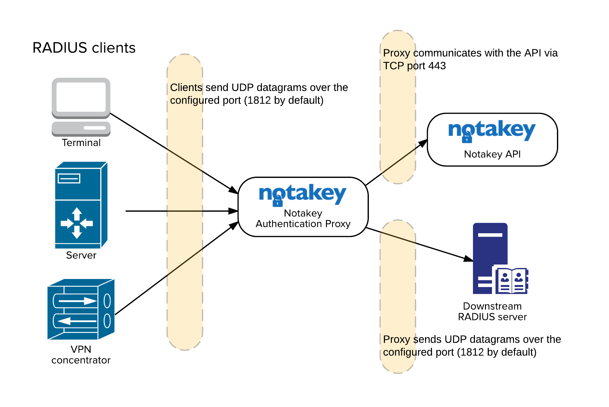

# Introduction

Notakey Authentication Proxy (NtkP) is a proxy server that allows transparently adding Notakey-based
2-factor authentication in existing systems, which are using standard authentication protocols.

Currently, NtkP supports RADIUS with PAP and CHAP authentication types.

# Technical Summary

NtkP manages a list of known IP addresses, which can send it requests. Each IP address
has a corresponding secret. Each of these IP addresses correspond to one upstream client.

NtkP also has one backing RADIUS server address and secret defined. This is the downstream RADIUS server.

When a RADIUS message is received, it will be transparently proxied to the downstream
server. Each incoming message will be decoded with the matching upstream secret, and
re-encoded with the downstream server's secret.

Each message returned by the downstream server will be similarly decoded and re-encoded,
to match the secret expected by the upstream client.

In addition, if the RADIUS message is an `Access-Request` message, then
the username contained in the message will be passed to Notakey API, and
await verification. If the end-user denies this request on their smartphone, the response will be
changed, before being returned to the upstream client.

While waiting for the user to respond on their smartphone, upstream clients may
time out, and re-send the Access-Request message. In this case, the proxy will
attempt to handle duplicate requests, based on packet ID values and corresponding
usernames.

## Flowchart


<aside class="notice">
See <a href="images/proxy_flow.png">enlarged version</a>.
</aside>

# System Requirements

## Docker

The recommended environment for NtkP is Docker, so any Docker-enabled host
should be fine.

## Windows

NtkP can alternatively be installed as a Windows system service. It has a dependency
on .NET Framework v4.5.

See: [Microsoft .NET Framework v4.5 system requirements](https://msdn.microsoft.com/en-us/library/8z6watww(v=vs.110).aspx).

# Installation instructions (Docker)

The recommended way to obtain NtkP is by using Docker. It is published as the
`notakey/authproxy` image. Use the tag `latest` to always use the latest version,
or specify a specific version, using the tag.

```shell
# Download the latest version
$ docker pull notakey/authproxy:latest

# Download a specific version
$ docker pull notakey/authproxy:1.0.0
```

The link to the Docker Hub page: [Notakey Authentication Proxy on Docker Hub](https://hub.docker.com/r/notakey/authproxy/).

# Installation instructions (MSI)

<aside class="notice">
The use of the MSI package is discouraged, in favor of the Docker version. The MSI
package will continue to be supported, however.
</aside>

...

# Configuration

## Configuring the MSI

...

## Configuring the Docker image

Parameters to the Docker image are set via environment variables.


```xml
<argument>https://demo.notakey.com/api/</argument>
<argument>65af8d56-b7d9-49b9-86c6-595dc440d933</argument>
<argument>/unattended</argument>
```

- The first argument should be a Notakey API endpoint (without the version number)
  with a trailing slash.
- The second argument should be a Notakey application access ID value. This value
  can be found in the Notakey dashboard, when viewing a specific application.
- The third argument should be left `/unattended`.

# Network Connectivity

NtkP will communicate with its RADIUS clients and the downstream RADIUS server
via one UDP port. This port can be different for clients and the downstream server,
but it can not be different for different clients.

Additionally, the TCP port 443 is required to be open between NtkP and the
designated Notakey API endpoint.



<aside class="notice">
See <a href="images/network_connectivity.png">enlarged version</a>.
</aside>

# Log files

The credential provider does not perform any logging.

However, the background service will create log files in the package's
`NotakeyBGService` folder.

## winsw.err.log

This file will contain information about errors.

## winsw.out.log

This file will contain informational output without errors.

# Status Messages

The logon UI will provide a status message, which reflects the status of the
background service.

The status will be re-checked every 10 seconds. Upon failure, the status check interval
will become progressively larger (exponential backoff).

## Service Status: OK

This message means that the background service is operational, and accessible,
and that the specified API endpoint is valid and reachable.

## Service Status: health-check request timed out. Is the background service running?

This message means that the background service is not running, or there is a permission
problem, which blocks the logon UI from communicating with it, using named pipes.

Double-check if the service is started, and if its identity is not restricted
from using named pipes.

## Service Status: service can not connect to API. Check network connectivity and API parameters.

The background service is operational, but the API endpoint is not reachable.

Double-check network connectivity, firewall rules and the API endpoint URL.

## Service Status: API call timed out.

The background service is operational, and the API endpoint was reachable at some point,
but not anymore.

Double-check network connectivity, and if the Notakey server can be reached.

## Service Status: error (&lt;error message&gt;)

This is a generic error message for unexpected issues.

# FAQ

## Does NtkP listen on only one port? Are accounting messages supported?

NtkP only listens to one port, and it expects authentication messages to be sent
on this port.

Listening to accounting messages is not currently supported.

## What are the implications for only supporting PAP and CHAP authentication modes?

PAP and CHAP do not sufficiently protect user credentials from man-in-the-middle
attacks.

These authentication types may be deemed secure-enough for use on an internal network,
where the risk for a MitM attack can be mitigated with other means.

<aside class="warning">
You should <em>never</em> use PAP and CHAP in an uncontrolled environment.
</aside>

## Why does NtkP support only PAP and CHAP?

PAP and CHAP are good enough for many use cases, so we have prioritized other tasks
over implementing more authentication methods.

Implementing more authentication methods is on our roadmap, however.


